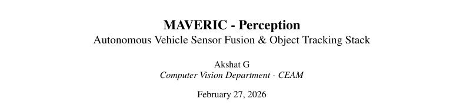

# Autonomous Vehicle Perception Stack (ADAS Level 4)


## Overview
This repository contains the perception pipeline for an Advanced Driver Assistance System (ADAS) Level 4 autonomous vehicle. The system integrates computer vision and LiDAR data to provide real-time environmental understanding, object detection, and safety monitoring, ensuring robust navigation in complex scenarios.

## System Architecture & Documentation

> **System Abstract:** This document describes the early design and implementation plan for the MAVERIC perception stack
prototype. It acts as a working technical record, capturing the system structure, key assumptions, and
practical engineering decisions that shape the initial version of the pipeline. The sections walk through the
perception flow from sensor inputs and calibration, through semantic interpretation, depth estimation, and
fusion logic, while also outlining how these components are expected to interact in a real deployment.
Rather than serving as final implementation documentation, this document functions as a foundation and
reference point for the prototype phase. A separate, more detailed implementation report will follow as the
system matures and design choices stabilize

**Review the Architecture:** Click the thumbnail below to view the detailed system design and research documentation.

[](maveric_perception_documentation.pdf)  

## Core Modules

### 1. Computer Vision Module
* **Tasks:** 2D Object Detection, Lane Detection, Traffic Light Recognition
* **Models:** [Insert models]
* **Processing:** Real-time image processing utilizing OpenCV and NumPy arrays

### 2. LiDAR Processing Module
* **Tasks:** 3D Bounding Box Estimation, Point Cloud Segmentation
* **Processing:** [Insert processing algorithms]

### 3. Sensor Fusion & Safety Monitors
* **Fusion Strategy:** [Insert fusion strategy]
* **Safety Monitors:** Integrated failsafes and redundancy checks to ensure high-confidence outputs required for Level 4 autonomy.

## Evaluation & Metrics
The perception stack was evaluated on latency, accuracy, and robustness:
* **Inference Speed (FPS):** ~15.5 FPS
* **mAP (Object Detection):** uses yolov8n
* **IoU (Segmentation):** 78%

## Installation & Usage

1. **Clone the repository:**
   ```bash
   git clone [https://github.com/yourusername/perception-stack.git](https://github.com/yourusername/perception-stack.git)
   cd perception-stack
